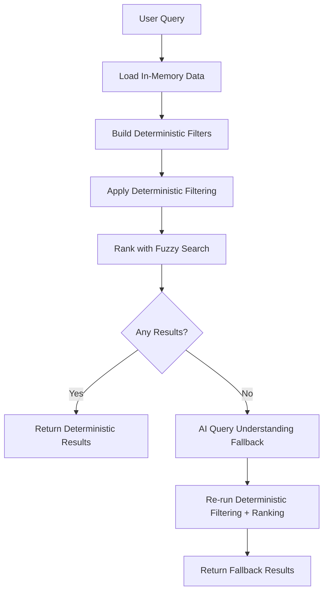

# Haalarikone

> Finland's easiest overall database – a unique way to explore Finnish student culture through colors.

Find out what color overall a student in a specific field wears.

## Overview

- **What it does:**  
  It helps you identify students' fields based on their signature overall colors.

- **Explore culture:**  
  Discover and learn about the colorful traditions of Finnish student life.

## Live Site

Check out the live project at: [haalarikone.fi](https://haalarikone.fi)

## Tech Stack

- **Framework:** Next.js 15 (App Router) with React 18
- **Language:** TypeScript
- **Styling:** Tailwind CSS with Radix UI components (Shadcn/ui)
- **Internationalization:** next-intl (Finnish, English, Swedish)
- **Search:** Deterministic in-memory filtering + fuzzy ranking, with AI fallback only on zero-result deterministic queries
- **AI/ML:** Vercel AI SDK with Anthropic Claude 3 Haiku (zero-result fallback only)
- **Email:** Resend (for feedback forms)
- **Analytics:** Databuddy
- **Testing:** Vitest + React Testing Library (unit/integration), Playwright (end-to-end)
- **Package Manager:** pnpm
- **Deployment:** Vercel

## Quick Links

- **Live Site:** [haalarikone.fi](https://haalarikone.fi)
- **Contributing Guidelines:** [CONTRIBUTING.md](./CONTRIBUTING.md)
- **Issue Tracker:** [`Issues` on GitHub](https://github.com/valtterisa/haalarikone/issues)
- **License:** [LICENSE](./LICENSE)

## Project Structure

```
student-overall-app/
├── app/                    # Next.js App Router pages
│   ├── [locale]/          # Localized routes (fi, en, sv)
│   │   ├── ala/           # Field pages
│   │   ├── alue/          # Area pages
│   │   ├── blog/          # Blog posts
│   │   ├── haalari/       # Overall detail pages
│   │   ├── oppilaitos/    # University pages
│   │   ├── vari/          # Color pages
│   │   └── page.tsx       # Home page
│   ├── api/               # API routes (search)
├── components/            # React components
│   ├── ui/                # Reusable UI components (Radix UI)
│   ├── search-modal.tsx   # Search functionality
│   ├── language-switcher.tsx  # i18n language switcher
│   ├── theme-switcher.tsx # Dark/light mode toggle
│   └── ...                # Feature components
├── content/               # Blog post content (JSON)
├── data/                  # Static data files
├── i18n/                  # Internationalization config
│   ├── routing.ts         # Route configuration
│   └── request.ts         # Request locale handling
├── lib/                   # Utility functions and helpers
│   ├── route-translations.ts  # Route segment translations
│   ├── slug-translations.ts   # Entity slug translations
│   ├── translate-path-client.ts  # Client-side path translation
│   ├── build-search-response.ts # Deterministic in-memory fuzzy search
│   ├── query-understanding.ts  # AI fallback query parsing
│   ├── load-color-data.ts      # Dynamic color data from JSON
│   └── ...                # Other utilities
├── messages/              # Translation files (fi.json, en.json, sv.json)
├── types/                 # TypeScript type definitions
├── utils/                 # Utility functions
└── tests/                 # Playwright tests
```

## Features

- **Multi-language Support:** Finnish (default), English, and Swedish
- **Deterministic Search:** In-memory fuzzy search with exact color/filter matching
- **Route Translation:** Automatic translation of route segments and slugs
- **Blog System:** Static blog posts with multi-language support
- **Theme Support:** Dark and light mode
- **Responsive Design:** Mobile-first approach with Tailwind CSS
- **SEO Optimized:** Dynamic metadata, sitemap, and structured data

## Search Architecture

The search system is deterministic-first and fully in-memory by default. It filters against local university and color data, then ranks candidates with Fuse fuzzy search. AI parsing is used only if deterministic search returns 0 results.

### How It Works



### Search Flow

1. **Deterministic Query Interpretation**
   - Extracts likely filters (color, area, school, field, organization) from the query using local in-memory values.
   - Detects color aliases directly from color metadata loaded from local data files.

2. **Deterministic Filtering**
   - Applies all extracted filters over the local dataset in memory.
   - Includes color-base matching and organization/slug matching.
   - Uses a field-relaxation fallback only when `organization + field` combination would otherwise produce no results.

3. **Fuzzy Ranking**
   - Ranks filtered candidates with Fuse.js.
   - Prioritizes exact organization/slug token matches before fuzzy tie-breaking.
   - Includes color text fields in fuzzy keys so color wording contributes to ranking quality.

4. **Color Variant Equivalence**
   - Color singular/plural and common aliases are treated as equivalent in fuzzy matching.
   - Examples (all base colors): valkoinen ↔ valkoiset, musta ↔ mustat, punainen ↔ punaiset, sininen ↔ siniset, vihreä ↔ vihreät, keltainen ↔ keltaiset, oranssi ↔ oranssit, violetti ↔ violetit, pinkki ↔ pinkit, harmaa ↔ harmaat, ruskea ↔ ruskeat, turkoosi ↔ turkoosit.

5. **AI Fallback (Only On Miss)**
   - If deterministic search returns zero results, API route calls AI query understanding and retries deterministic filtering/ranking.
   - This keeps AI usage low while preserving recovery for ambiguous or noisy queries.

### Key Benefits

- **Lower Cost:** Most queries are resolved without AI calls.
- **Predictable Results:** One deterministic pipeline handles normal search traffic.
- **Natural Color Queries:** Finnish singular/plural color forms match reliably.
- **Fast Runtime:** Local in-memory filtering + fuzzy ranking avoids network/model latency on common paths.

## Contributing

We welcome contributions! Please see [CONTRIBUTING.md](./CONTRIBUTING.md) for guidelines on how to contribute to this project.

## Contact

For any questions or feedback, feel free to reach out:

- **Email:** [savonen.emppu@gmail.com](mailto:savonen.emppu@gmail.com)
- **GitHub:** [@valtterisa](https://github.com/valtterisa)

## License

See [LICENSE](./LICENSE) file for details.

---

Made by [@valtterisa](https://github.com/valtterisa)
