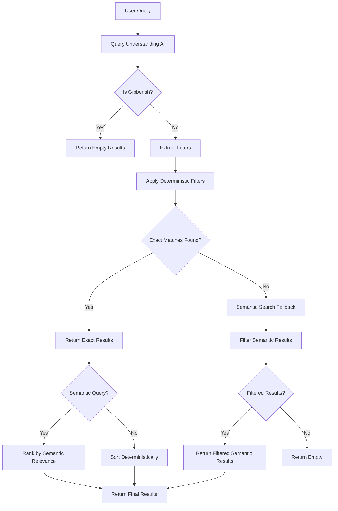

# Haalarikone

> Finland's easiest overall database – a unique way to explore Finnish student culture through colors.

Find out what color overall a student in a specific field wears.

## Overview

- **What it does:**  
  It helps you identify students' fields based on their signature overall colors.

- **Explore culture:**  
  Discover and learn about the colorful traditions of Finnish student life.

## Live Site

Check out the live project at: [haalarikone.fi](https://haalarikone.fi)

## Tech Stack

- **Framework:** Next.js 15 (App Router) with React 18
- **Language:** TypeScript
- **Styling:** Tailwind CSS with Radix UI components (Shadcn/ui)
- **Internationalization:** next-intl (Finnish, English, Swedish)
- **Search:** AI-powered query understanding (Anthropic Claude) + deterministic filtering + semantic search (Upstash)
- **AI/ML:** Vercel AI SDK with Anthropic Claude 3 Haiku
- **Rate Limiting & Caching:** Upstash Redis
- **Email:** Resend (for feedback forms)
- **Analytics:** Databuddy
- **Testing:** Vitest + React Testing Library (unit/integration), Playwright (end-to-end)
- **Package Manager:** pnpm
- **Deployment:** Vercel

## Quick Links

- **Live Site:** [haalarikone.fi](https://haalarikone.fi)
- **Contributing Guidelines:** [CONTRIBUTING.md](./CONTRIBUTING.md)
- **Issue Tracker:** [`Issues` on GitHub](https://github.com/valtterisa/haalarikone/issues)
- **License:** [LICENSE](./LICENSE)

## Project Structure

```
student-overall-app/
├── app/                    # Next.js App Router pages
│   ├── [locale]/          # Localized routes (fi, en, sv)
│   │   ├── ala/           # Field pages
│   │   ├── alue/          # Area pages
│   │   ├── blog/          # Blog posts
│   │   ├── haalari/       # Overall detail pages
│   │   ├── oppilaitos/    # University pages
│   │   ├── vari/          # Color pages
│   │   └── page.tsx       # Home page
│   ├── api/               # API routes (search, upsert)
├── components/            # React components
│   ├── ui/                # Reusable UI components (Radix UI)
│   ├── search-modal.tsx   # Search functionality
│   ├── language-switcher.tsx  # i18n language switcher
│   ├── theme-switcher.tsx # Dark/light mode toggle
│   └── ...                # Feature components
├── content/               # Blog post content (JSON)
├── data/                  # Static data files
├── i18n/                  # Internationalization config
│   ├── routing.ts         # Route configuration
│   └── request.ts         # Request locale handling
├── lib/                   # Utility functions and helpers
│   ├── route-translations.ts  # Route segment translations
│   ├── slug-translations.ts   # Entity slug translations
│   ├── translate-path-client.ts  # Client-side path translation
│   ├── query-understanding.ts  # AI-powered query parsing
│   ├── deterministic-filter.ts  # Exact filter matching
│   ├── semantic-search.ts      # Vector/semantic search fallback
│   ├── semantic-ranking.ts     # Result ranking by relevance
│   ├── load-color-data.ts      # Dynamic color data from JSON
│   └── ...                # Other utilities
├── messages/              # Translation files (fi.json, en.json, sv.json)
├── types/                 # TypeScript type definitions
├── utils/                 # Utility functions
└── tests/                 # Playwright tests
```

## Features

- **Multi-language Support:** Finnish (default), English, and Swedish
- **AI-Powered Search:** Intelligent query understanding with exact result counts
- **Route Translation:** Automatic translation of route segments and slugs
- **Blog System:** Static blog posts with multi-language support
- **Theme Support:** Dark and light mode
- **Responsive Design:** Mobile-first approach with Tailwind CSS
- **SEO Optimized:** Dynamic metadata, sitemap, and structured data

## Search Architecture

The search system uses a hybrid approach combining AI-powered query understanding with deterministic filtering and semantic search fallback.

### How It Works



### Search Flow

1. **Query Understanding (AI)**
   - Uses Anthropic Claude 3 Haiku to parse natural language queries
   - Extracts structured filters: color, area, field, school
   - Handles Finnish morphology (plural forms, case endings, genitive case)
   - Detects gibberish queries for early exit
   - Returns remaining semantic query text for ranking

2. **Deterministic Filtering**
   - Applies exact filters on local JSON dataset (~6000 records)
   - Guarantees exact result counts (no arbitrary limits)
   - Filters by: color (with variant matching), area, field, school
   - Fast in-memory filtering with caching

3. **Semantic Search Fallback**
   - Only triggered when exact filters return 0 results
   - Uses Upstash Search for vector/semantic search
   - Applies same filters to semantic results
   - Ensures semantic results still match filter criteria

4. **Ranking**
   - If semantic query exists, ranks results by keyword relevance
   - Otherwise, sorts deterministically (by school, then field)
   - Exact matches are always prioritized

### Key Benefits

- **Exact Counts:** Always returns complete result sets, not limited to top N
- **Intelligent Parsing:** Understands natural language queries in Finnish, English, Swedish
- **Fast Performance:** Deterministic filtering is ~10-50ms, AI parsing ~200-400ms
- **Fallback Safety:** Semantic search only when needed, still respects filters

## Contributing

We welcome contributions! Please see [CONTRIBUTING.md](./CONTRIBUTING.md) for guidelines on how to contribute to this project.

## Contact

For any questions or feedback, feel free to reach out:

- **Email:** [savonen.emppu@gmail.com](mailto:savonen.emppu@gmail.com)
- **GitHub:** [@valtterisa](https://github.com/valtterisa)

## License

See [LICENSE](./LICENSE) file for details.

---

Made by [@valtterisa](https://github.com/valtterisa)
